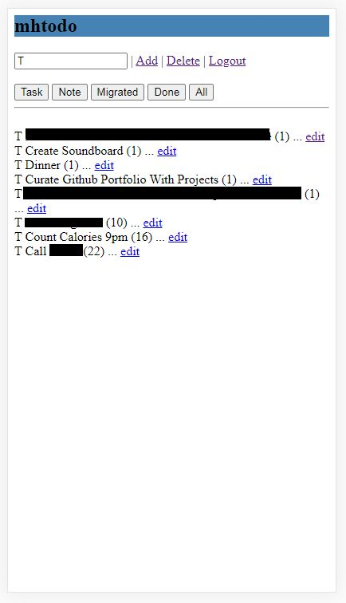
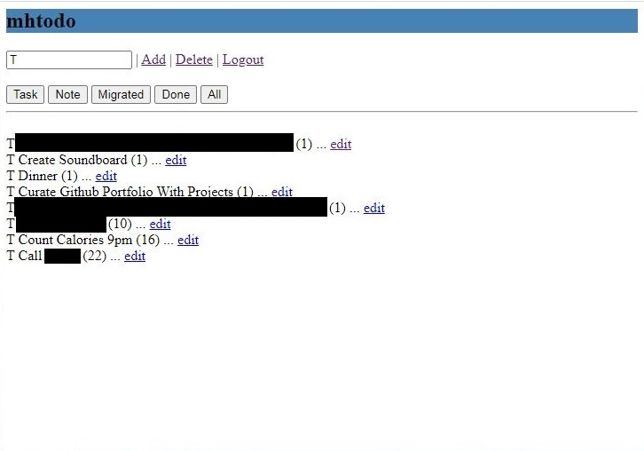
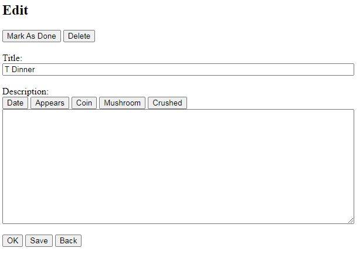
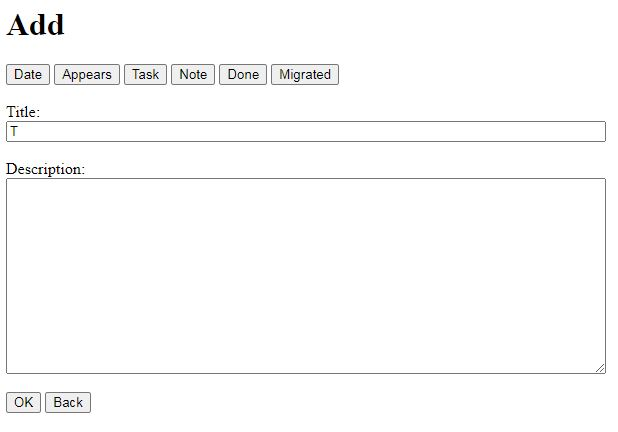

# mhtodo
A responsive todolist created in PHP

This application is is based on an idea that I had for a todolist / note taking application. I liked the idea of the Bullet Journal but I wanted to have something digitaltally. What I found was that I could categorize each bullet with a single letter hence my name for this concept I call it the "TNX method". TNX stands for the most common types: Task, Note, Done. The application uses the default text as it's style with buttons and links giving it a retro look. It has buttons that make sounds so you can reward yourself after completing a task. It has a sqlite database 

# Features

 - Delete mode: deletes multiple items in the tasks page
 - Mario sound effects
 - Filter on title: case sensitive so that you can filter by type 
 - On PC, you can save on the edit page by pressing ctrl+s
 - Quickly insert the current date into the description by pressing the "Date button", this is good for keeping a log of things, e.g. exercise, diary, diet, habits, etc.
 - Single user login: The application currently only has the username and password hardcoded into the login file. 
 
 # Screenshots
 
 *screenshot_Tasks_todo_mobile_screenshot_censored.jpg*

*screenshot_PC_tasks_todo_censored.JPG*

*screenshot_PC_edit.JPG*

*screenshot_PC_add.JPG*
